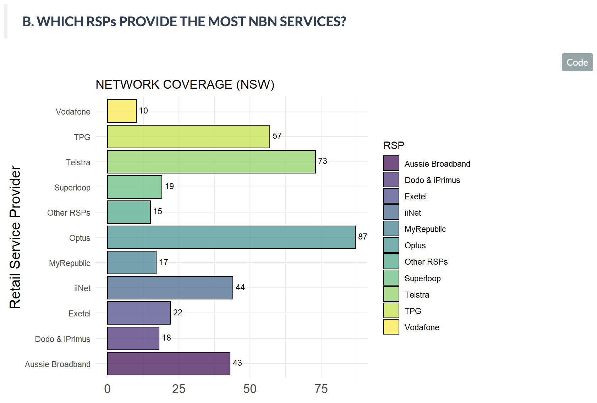
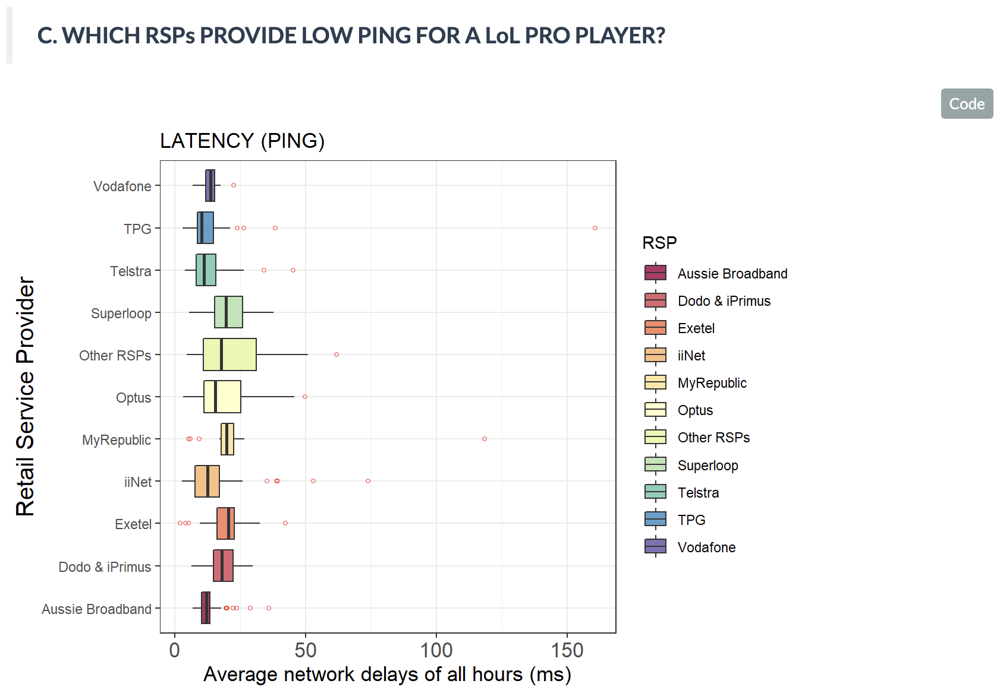

# RStudio-Analysis-of-broadband-service

## Data source 
https://data.gov.au/data/dataset/measuring-broadband-australia-report-15-dataset-release

## Purpose
Suppose in NSW, we need to suggest a suitable network service from one of the providers to a LoL gamer.
We would decide which one is the best base on network coverage (number of Retail Service Providers) in the area, and latency (average network delays in all hours).

Therefore, we aiming for brands that has high network coverage and low latency. From our analysis, it’s recommended that clients choose `Telstra`, `Optus` or `Aussie Broadband`. Among 3, `Telstra` ranks higher in total.

  

  

## Note
This is 2024 and it's not the latest data.
